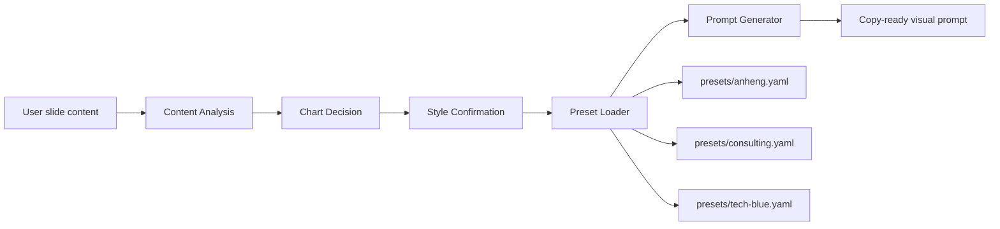
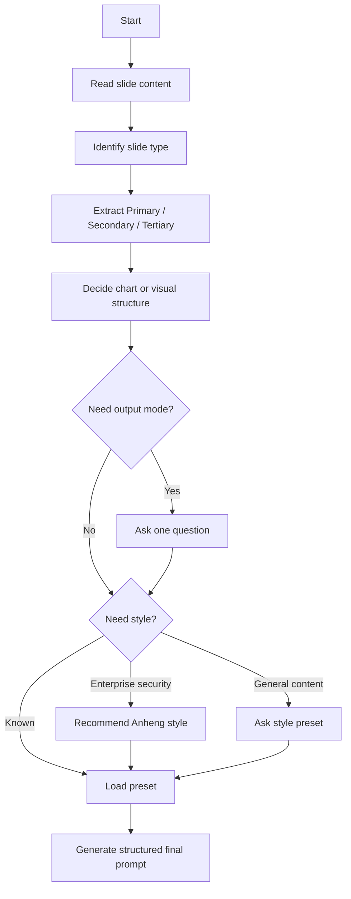

<p align="center">
  
</p>

<p align="center">
  <a href="./LICENSE"></a>
  
  
  
  
</p>

# ppt-visual-prompt-designer

`ppt-visual-prompt-designer` is a multi-turn Claude Skill for transforming slide content into presentation-ready visual generation prompts.

It is not a PPT generator. It helps Claude analyze a slide's message, choose a justified chart or visual structure, confirm missing design constraints, load a style preset, and output a copy-ready final prompt for AI visual tools.

## Core Capabilities

- Multi-turn requirement clarification
- Information hierarchy analysis
- Chart decision engine
- Style presets
- Anheng enterprise cybersecurity style support
- Chinese and English output fields based on user language
- Bottom-image mode and finished-image mode

## Architecture



## Workflow



## Style Presets

| Preset | File | Best For |
|---|---|---|
| Anheng | `presets/anheng.yaml` | Cybersecurity, government-enterprise reports, SOC, AI security, enterprise security solutions |
| Consulting | `presets/consulting.yaml` | Business reports, executive decks, strategy pages, data-heavy slides |
| Tech Blue | `presets/tech-blue.yaml` | Blue technology launch visuals, AI safety events, cyber timelines, infrastructure narratives |

If the user does not specify a style and the content is about cybersecurity, government-enterprise reporting, security launch events, SOC, attack-defense, data security, AI security, code audit security, or digital infrastructure, the skill recommends Anheng style first.

## Installation

```bash
npx skills add <repo-url>
```

Replace `<repo-url>` with this repository's GitHub URL.

## Example

### Input

```text
请把这一页转成 PPT 画面提示词：

标题：消失的叙事——Fable 5 & Mythos 5 的强制下线与合规静默
核心定位：通过梳理 72 小时内从发布到全面下线的时间线，呈现监管力量对顶级 AI 模型的强制干预。

节点：
- 6月9日：模型发布
- 6月12日：BIS 介入并下达 EAR 紧急出口管制指令
- 权限阻断：内部非美籍员工权限被剥离
- 全面下线：全球暂停模型服务接入
```

### First Response

```markdown
## 初步分析
- 页面类型: 时间线 / AI 安全事件开场页
- 核心信息: 顶级 AI 模型一旦触及双用途安全边界，技术发布会迅速进入国家安全与出口管制框架。
- 主要层级: 72 小时内从模型发布到监管介入、权限阻断、全球下线的强制干预过程。
- 次要层级: 发布、BIS/EAR 介入、权限隔离、全球暂停四个关键节点。
- 三级层级: 0-day 自动化挖掘、漏洞利用代码生成、关键信息基础设施风险。
- 图表决策: 不使用传统统计图表；更适合横向时间线 + 安全隔离视觉。
- 输出模式: 待确认。

## 需要确认
输出模式选无文字底图，还是带标题和正文的成品图？
```

### Final Output Excerpt

```markdown
## 页面类型
时间线 / AI 安全事件开场页

## 图表决策
- 决策: 不使用传统统计图表。
- 理由: 页面表达事件进程和监管干预，不是数量比较或占比关系。
- 图表/结构类型: 横向时间线 + 风险触发模块 + 安全隔离视觉。

## 最终画面提示词
生成一张 16:9 蓝色科技感发布会风格 PPT 成品页...
```

## Repository Structure

```text
ppt-visual-prompt-designer/
├── SKILL.md
├── README.md
├── LICENSE
├── CHANGELOG.md
├── .gitignore
├── examples/
│   ├── cover-slide.md
│   ├── timeline-slide.md
│   └── data-slide.md
├── presets/
│   ├── anheng.yaml
│   ├── consulting.yaml
│   └── tech-blue.yaml
└── tests/
    └── eval_cases.md
```

## License

MIT License. See [LICENSE](./LICENSE).
