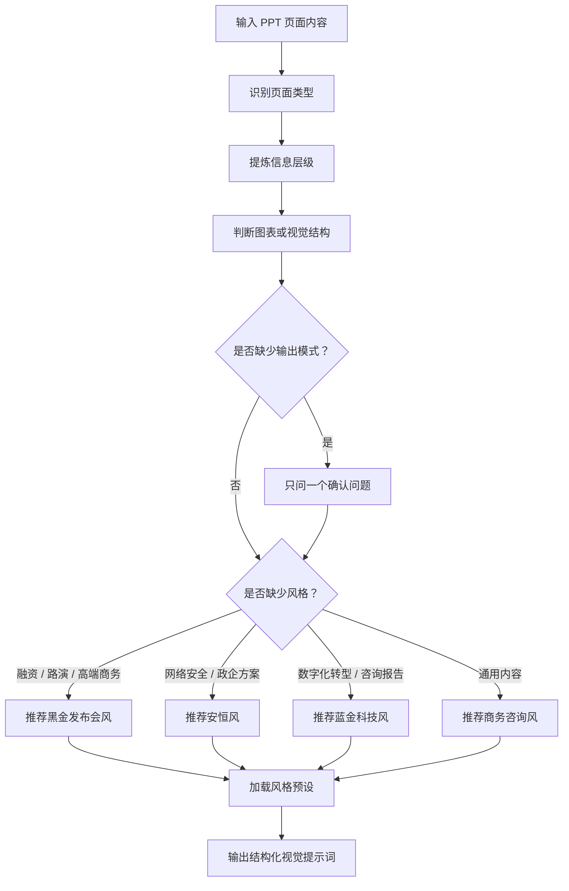

<p align="center">
  
</p>

<p align="center">
  <a href="./LICENSE"></a>
  
  
  
  
</p>

<p align="center">
  <a href="./README.md">English</a> | 简体中文
</p>

# ppt-viz

`ppt-viz` 是一个用于 **PPT 视觉提示词设计** 的多轮技能，也可以用中文短名 `PPT设计` 唤醒。

它不是 PPT 生成器，也不会直接生成图片或 PPTX 文件。它的作用是帮助 Codex / Claude 分析一页 PPT 的核心信息、判断是否需要图表或结构化视觉、选择合适的风格预设，并输出一段可以复制到 AI 绘图工具、AI PPT 工具、Figma、Midjourney、GPT Image 等工具中的高质量画面提示词。

## 核心能力

- 分析 PPT 页面类型，例如封面、数据页、流程页、对比页、时间线、架构图、总结页等
- 提炼页面的主要层级、次要层级和三级细节
- 判断是否需要图表，以及适合使用哪种图表或视觉结构
- 根据内容自动推荐风格预设
- 支持底图模式和成品图模式
- 支持中文和英文输出结构
- 输出可直接复制使用的最终画面提示词
- 支持“整套 PPT 风格一致性模式”，为多页 PPT 建立统一视觉系统并批量生成提示词
- 内置“设计经验规则库”，用于判断风格适配、色彩语义、内容密度、图表选择、可读性和视觉一致性

## 适合场景

- 把一页 PPT 文案转换成画面生成提示词
- 为商业计划书、融资路演、战略报告、咨询报告设计页面视觉
- 为时间线、流程图、能力模型、架构图、对比页设计视觉结构
- 判断一页内容应该做成图表、路线图、卡片组、场景图还是抽象视觉
- 为 Midjourney、GPT Image、AI PPT、Keynote、Figma AI 等工具准备提示词

## 工作流



## 风格预设

| 风格 | 文件 | 适合内容 |
|---|---|---|
| 安恒风 | `presets/anheng.yaml` | 网络安全、政企汇报、SOC、AI 安全、数据安全、企业安全方案 |
| 商务咨询风 | `presets/consulting.yaml` | 商业报告、战略页、市场分析、管理层汇报、数据型页面 |
| 蓝色科技风 | `presets/tech-blue.yaml` | AI、网络安全、基础设施、技术发布、科技叙事 |
| 蓝金科技风 | `presets/blue-gold-tech.yaml` | 数字化转型、战略咨询、能力模型、价值创造、企业升级路线图 |
| 黑金发布会风 | `presets/black-gold-launch.yaml` | 融资计划、投资人路演、商业计划书、公司介绍、高端发布会 |

## 输出模式

**底图模式**：只生成视觉背景，不在画面中生成可读标题、正文、图表标签、Logo、页码或注释。适合后续在 PPT 中叠加可编辑文字。

**成品图模式**：生成带标题、正文、图表文字或说明文字的完整画面。适合快速出概念图，但图片中的文字可能需要人工校正。

## 整套 PPT 风格一致性模式

当用户想要生成一整套 PPT、多页提示词，或希望“这几页保持同一风格”时，`ppt-viz` 会进入 `deck-consistency` 模式。

这个模式不会简单地逐页批量生成 prompt。它会先建立一套 **Deck Visual System**，再规划页面结构，最后逐页生成画面提示词，确保整套 PPT 统一但不重复。

适合触发语句：

```text
请为 10 页 AI 产品发布会生成统一风格的 PPT 画面提示词
```

输出内容包括：

1. Deck Visual System
2. 页面结构规划
3. 逐页 prompt
4. 一致性检查清单

Deck Visual System 会统一定义整套 PPT 的类型、风格预设、画幅、背景系统、色彩语义、字体系统、标题系统、页面网格、视觉母题、图标风格、图表风格、卡片风格、页面类型规则、文字策略和图片策略。

## Design Heuristics / 设计经验规则库

`ppt-viz` 在 `references/design-heuristics.md` 中内置了一套设计经验规则。单页模式和整套 PPT 风格一致性模式都会在生成最终 prompt 前应用这些规则。

规则库覆盖色彩语义、内容密度控制、风格适配、页面类型匹配、图表选择、文字入图、品牌一致性、整套 PPT 视觉一致性、可读性优先、设计克制、信息压缩和场景优先。

如果用户要求与设计经验冲突，Skill 应主动提示并给出更优方案。例如建议拆页、改用无文字底图、从深色发布会风切换到白底咨询风，或在没有真实数据关系时避免强行使用统计图。

## 安装

```bash
npx skills add https://github.com/cici541/ppt-viz
```

安装后，重启 Codex / Claude 环境以加载新技能。

## 使用方式

可以使用英文短名：

```text
用 ppt-viz 处理这页，蓝金科技风，底图模式
```

也可以使用中文短名：

```text
PPT设计，把下面这页内容转成视觉提示词
```

推荐输入格式：

```text
PPT设计：

页面标题：AI 赋能企业数字化转型
页面内容：
1. 降本增效
2. 智能运营
3. 数据驱动决策
4. 组织能力升级

要求：16:9，蓝金科技风，底图模式
```

## 示例

### 输入

```text
PPT设计，把这页内容转成视觉提示词：

标题：演进之路：从大模型到智能体 Harness 工程
内容：
第一阶段：基础大模型
第二阶段：RAG 与工具调用
第三阶段：单体智能体
第四阶段：Agent Harness 工程体系

要求：蓝金科技风，成品图模式，使用向上攀升的阶梯结构。
```

### 输出结构

```markdown
## 页面类型

## 核心信息

## 视觉层级
- 主要层级:
- 次要层级:
- 三级层级:

## 图表决策
- 决策:
- 理由:
- 图表/结构类型:

## 版式规划

## 风格定义
- 风格预设:
- 字体规范:
- 品牌色:
- 视觉风格:
- 画幅与密度:

## 输出模式

## 最终画面提示词
```

## 仓库结构

```text
ppt-viz/
├── SKILL.md
├── README.md
├── README.zh-CN.md
├── LICENSE
├── CHANGELOG.md
├── examples/
├── references/
│   └── design-heuristics.md
├── presets/
│   ├── anheng.yaml
│   ├── black-gold-launch.yaml
│   ├── blue-gold-tech.yaml
│   ├── consulting.yaml
│   └── tech-blue.yaml
└── tests/
```

## 许可

MIT License. See [LICENSE](./LICENSE).
